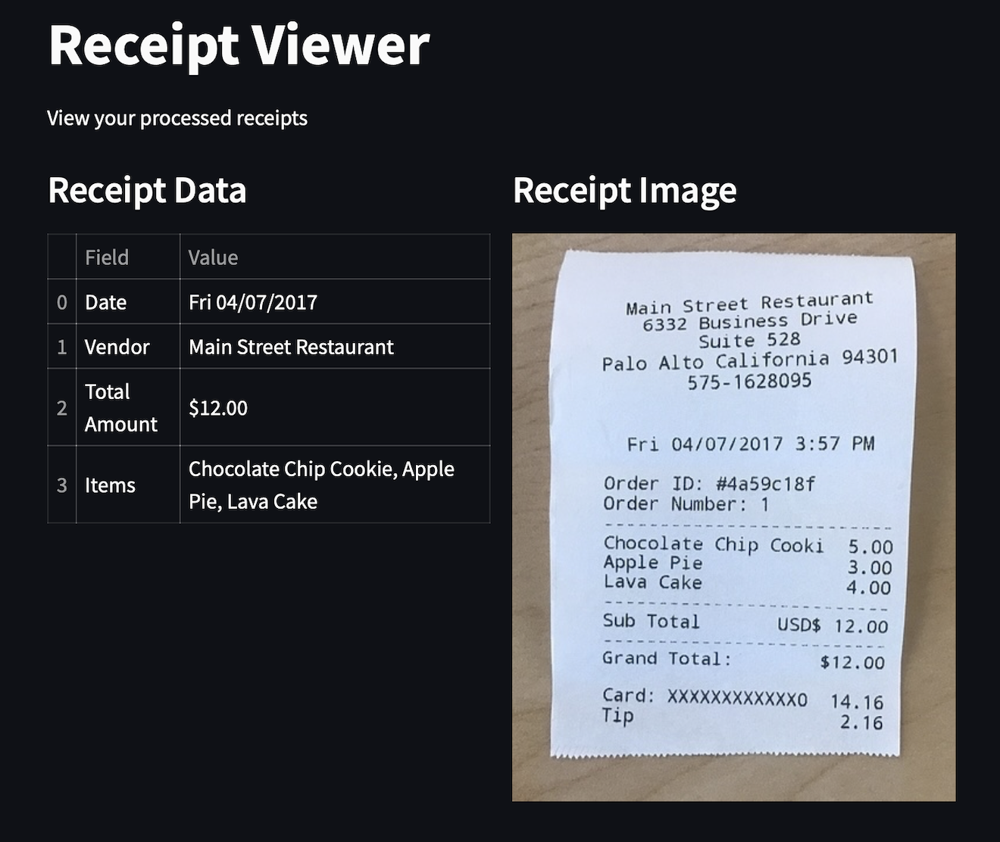

# Receipt Analyzer Agents

This application processes receipts using two ollama agents: a receipt vision model and a writer model. 




## Prerequisites

1. Install Ollama: https://ollama.ai/

2. Pull the llama3.2-vision and llama3.2 models:
```bash
ollama pull llama3.2-vision
ollama pull llama3.2
```

3. Place your receipts in the `receipts` directory (supported formats: JPG, JPEG, PNG, PDF)

## Usage

Run the script:

```
python receipt_agent.py
```

The script will:
1. Process all receipts in the receipts directory
2. Generate a printed reported with the extracted data 

## Demo

streamlit demo on browser showing a list of images and data extracted from receipts:

```
streamlit run app.py
```
